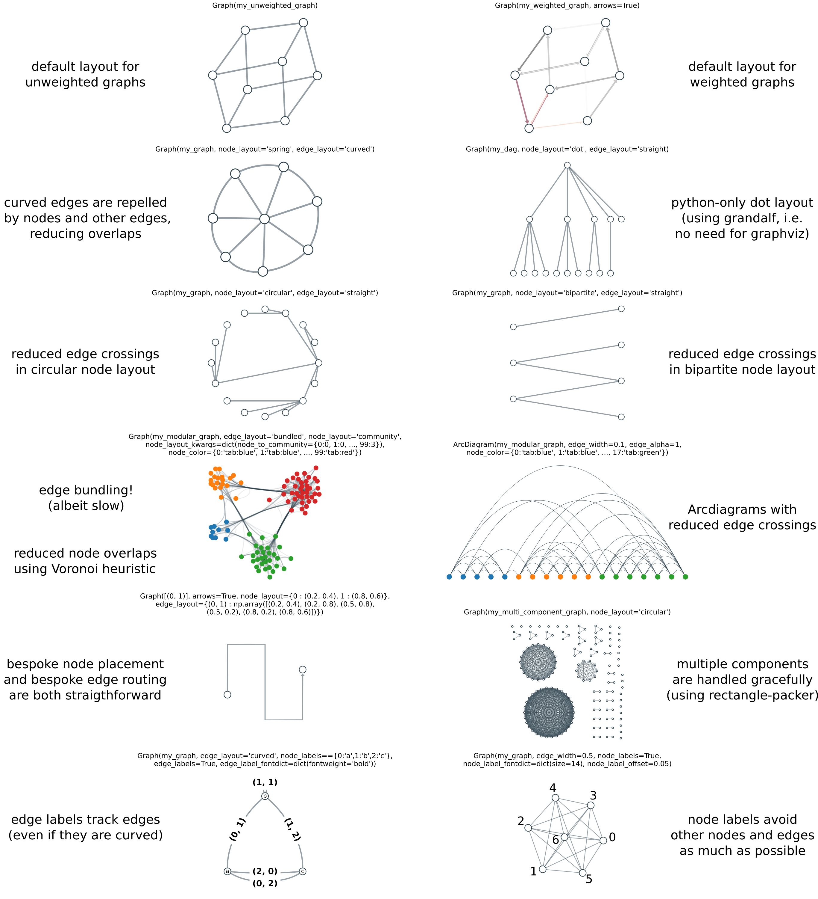

# netgraph

[](https://pepy.tech/project/netgraph)

Netgraph is a python library for creating publication quality plots of networks.
Netgraph is compatible with a variety of network data formats, including `networkx` and `igraph` `Graph` objects.


## Installation

Install the current release of `netgraph` with:

``` shell
pip install netgraph
```


## Documentation

The documentation of the full API, as well as numerous code examples can be found on [ReadTheDocs](https://netgraph.readthedocs.io/en/latest/index.html).


## Quickstart

``` python
import matplotlib.pyplot as plt
from netgraph import Graph, InteractiveGraph, EditableGraph

# Several graph formats are supported:

# 1) edge lists
graph_data = [(0, 1), (1, 2), (2, 0)]

# 2) edge list with weights
graph_data = [(0, 1, 0.2), (1, 2, -0.4), (2, 0, 0.7)]

# 3) full rank matrices
import numpy
graph_data = np.random.rand(10, 10)

# 4) networkx Graph and DiGraph objects (MultiGraph objects are not supported, yet)
import networkx
graph_data = networkx.karate_club_graph()

# 5) igraph.Graph objects
import igraph
graph_data = igraph.Graph.Famous('Zachary')

# 6) graph_tool.Graph objects
import graph_tool.collection
graph_data = graph_tool.collection.data["karate"]

# Create a non-interactive plot:
Graph(graph_data)
plt.show()

# Create an interactive plot, in which the nodes can be re-positioned with the mouse.
# NOTE: you must retain a reference to the plot instance!
# Otherwise, the plot instance will be garbage collected after the initial draw
# and you won't be able to move the plot elements around.
# For related reasons, if you are using PyCharm, you have to execute the code in
# a console (Alt+Shift+E).
plot_instance = InteractiveGraph(graph_data)
plt.show()

# Create an editable plot, which is an interactive plot with the additions
# that nodes and edges can be inserted or deleted, and labels and annotations
# can be created, edited, or deleted as well.
plot_instance = EditableGraph(graph_data)
plt.show()

# read the documentation for a full list of available arguments
help(Graph)
help(InteractiveGraph)
help(EditableGraph)
```


## Reasons why you might want to use netgraph


### Better layouts




### Interactivity

Algorithmically finding a visually pleasing graph layout is hard.
This is demonstrated by the plethora of different algorithms in use
(if graph layout was a solved problem, there would only be one
algorithm). To ameliorate this problem, this module contains an
`InteractiveGraph` class, which allows node positions to be tweaked
with the mouse after an initial draw.

- Individual nodes and edges can be selected using the left-click.
- Multiple nodes and or edges can be selected by holding `control`
  while clicking, or by using the rectangle/window selector.
- Selected plot elements can be dragged around by holding left-click
  on a selected artist.


``` python
import matplotlib.pyplot as plt
import networkx as nx
from netgraph import InteractiveGraph

g = nx.house_x_graph()

edge_color = dict()
for ii, edge in enumerate(g.edges):
    edge_color[edge] = 'tab:gray' if ii%2 else 'tab:orange'

node_color = dict()
for node in g.nodes:
    node_color[node] = 'tab:red' if node%2 else 'tab:blue'

plot_instance = InteractiveGraph(
    g, node_size=5, node_color=node_color,
    node_labels=True, node_label_offset=0.1, node_label_fontdict=dict(size=20),
    edge_color=edge_color, edge_width=2,
    arrows=True, ax=ax)

plt.show()
```

There is also some experimental support for editing the graph
elements interactively using the `EditableGraph` class.

- Pressing `insert` or `+` will add a new node to the graph.
- Double clicking on two nodes successively will create an edge between them.
- Pressing `delete` or `-` will remove selected nodes and edges.
- Pressing `@` will reverse the direction of selected edges.

When adding a new node, the properties of the last selected node will
be used to style the node artist. Ditto for edges. If no node or edge
has been previously selected, the first created node or edge artist
will be used.


Finally, elements of the graph can be labeled and annotated. Labels
remain always visible, whereas annotations can be toggled on and off by
clicking on the corresponding node or edge.

- To create or edit a node or edge label, select the node (or edge)
  artist, press the `enter` key, and type.
- To create or edit an annotation, select the node (or edge) artist,
  press `alt + enter`, and type.
- Terminate either action by pressing `enter` or `alt + enter` a
  second time.


``` python
import matplotlib.pyplot as plt
import networkx as nx
from netgraph import EditableGraph

g = nx.house_x_graph()

edge_color = dict()
for ii, (source, target) in enumerate(g.edges):
    edge_color[(source, target)] = 'tab:gray' if ii%2 else 'tab:orange'

node_color = dict()
for node in g.nodes:
    node_color[node] = 'tab:red' if node%2 else 'tab:blue'

annotations = {
    4 : 'This is the representation of a node.',
    (0, 1) : dict(s='This is not a node.', color='red')
}


fig, ax = plt.subplots(figsize=(10, 10))

plot_instance = EditableGraph(
    g, node_color=node_color, node_size=5,
    node_labels=True, node_label_offset=0.1, node_label_fontdict=dict(size=20),
    edge_color=edge_color, edge_width=2,
    annotations=annotations, annotation_fontdict = dict(color='blue', fontsize=15),
    arrows=True, ax=ax)

plt.show()
```

### Fine control over plot elements

High quality figures require fine control over plot elements.
To that end, all node artist and edge artist properties can be specified in three ways:

1. Using a single scalar or string that will be applied to all artists.

``` python
import matplotlib.pyplot as plt
from netgraph import Graph

edges = [(0, 1), (1, 1)]
Graph(edges, node_color='red', node_size=4.)
plt.show()
```

2. Using a dictionary mapping individual nodes or individual edges to a property:

``` python
import matplotlib.pyplot as plt
from netgraph import Graph

Graph([(0, 1), (1, 2), (2, 0)],
      edge_color={(0, 1) : 'g', (1, 2) : 'lightblue', (2, 0) : np.array([1, 0, 0])},
      node_size={0 : 20, 1 : 4.2, 2 : np.pi},
)
plt.show()
```

3. By directly manipulating the node and edge artists (which are derived from matplotlib PathPatch artists):

``` python
import matplotlib.pyplot as plt; plt.ion()
from netgraph import Graph

fig, ax = plt.subplots()
g = Graph([(0, 1), (1, 2), (2, 0)], ax=ax)

# make some changes
g.edge_artists[(0, 1)].set_facecolor('red')
g.edge_artists[(1, 2)].set_facecolor('lightblue')

# force redraw to display changes
fig.canvas.draw()
```

Similarly, node and edge labels are just matplotlib text objects.
Their properties can also be specified using a single value that is applied to all of them:

``` python
import matplotlib.pyplot as plt
from netgraph import Graph

Graph([(0, 1)],
    node_size=20,
    node_labels={0 : 'Lorem', 1 : 'ipsum'},
    node_label_fontdict=dict(size=18, fontfamily='Arial', fontweight='bold'),
    edge_labels={(0, 1) : 'dolor sit'},
    # blue bounding box with red edge:
    edge_label_fontdict=dict(bbox=dict(boxstyle='round',
                                       ec=(1.0, 0.0, 0.0),
                                       fc=(0.5, 0.5, 1.0))),
)
plt.show()
```

Alternatively, their properties can be manipulated individually after an initial draw:

``` python
import matplotlib.pyplot as plt
from netgraph import Graph

fig, ax = plt.subplots()
g = Graph([(0, 1)],
    node_size=20,
    node_labels={0 : 'Lorem', 1 : 'ipsum'},
    edge_labels={(0, 1) : 'dolor sit'},
    ax=ax
)

# make some changes
g.node_label_artists[1].set_color('hotpink')
g.edge_label_artists[(0, 1)].set_style('italic')

# force redraw to display changes
fig.canvas.draw()
plt.show()
```

For a full list of available arguments, please consult the docstrings
of the `Graph` or `InteractiveGraph` class:

```python
from netgraph import Graph; help(Graph)
```

## Recent changes

- 4.9.1 Fixed issue #48, which occurred when computing a curved edge layout for graphs with multiple components. Also improved edge routing algorithm slightly.
- 4.9.0 Implemented a layered and a shell layout for multi-partite graphs.
- 4.8.2 Fixed issue #45, which prevented a warning to be raised when trying to plot networkx.MultiGraph instances.
- 4.8.1 Fixed issue #44, that occurred if a single node was plotted with the Sugiyama layout (thanks @wilkeber).
- 4.8.0 Refined community node layout. Communities are rotated w.r.t. each other to reduce the length of edges between them.
- 4.7.1 Fixed issue #41, which occurred when computing the community layout for communities without within-community edges.
- 4.7.0 Implemented a radial tree node layout
- 4.6.0 Support drawing of graph_tool.Graph objects
- 4.5.0 Support custom mappings for mouse-over highlight events (issue #39)
- 4.4.1 Corrected imports for testing _arcdiagram.py
- 4.4.0 Added bipartite node layouts.
- 4.3.0 Added the ArcDiagram class and interactive/editable variants.
- 4.2.4 Plotting of graphs with a single node is now supported.
- 4.2.3 Fixed a bug that occurred when using the community layout with at least one community containing a single node
- 4.2.2 Fixed a bug that occurred every time an InteractiveGraph was initialised withut tabular annotations
- 4.2.1 Added online documentation

## Help, I don't know how to do ...!

Please raise an issue. Include any relevant code and data in a
[minimal, reproducible
example](https://stackoverflow.com/help/minimal-reproducible-example).
If applicable, make a sketch of the desired result with pen and paper,
take a picture, and append it to the issue.

Bug reports are, of course, always welcome. Please make sure to
include the full error trace.

If you submit a pull request that fixes a bug or implements a
cool feature, I will probably worship the ground you walk on for the
rest of the week. Probably.

Finally, if you do email me, please be very patient. I rarely check
the email account linked to my open source code, so I probably will
not see your emails for several weeks, potentially longer. Also, I have a
job that I love and that pays my bills, and thus takes priority. That
being said, the blue little notification dot on github is surprisingly
effective at getting my attention. So please just raise an issue.
