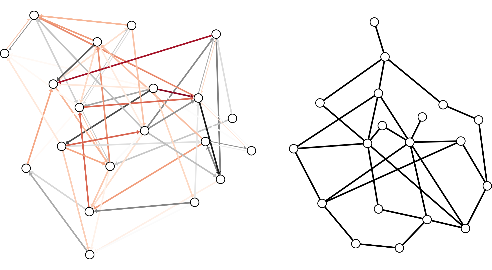
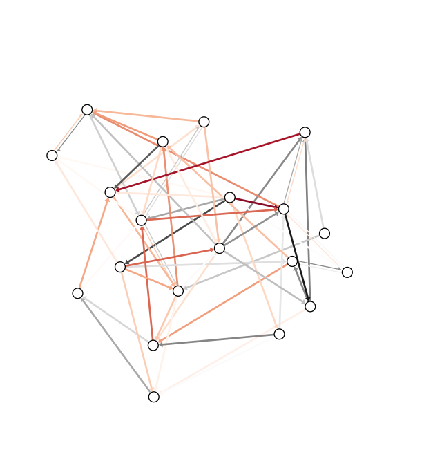
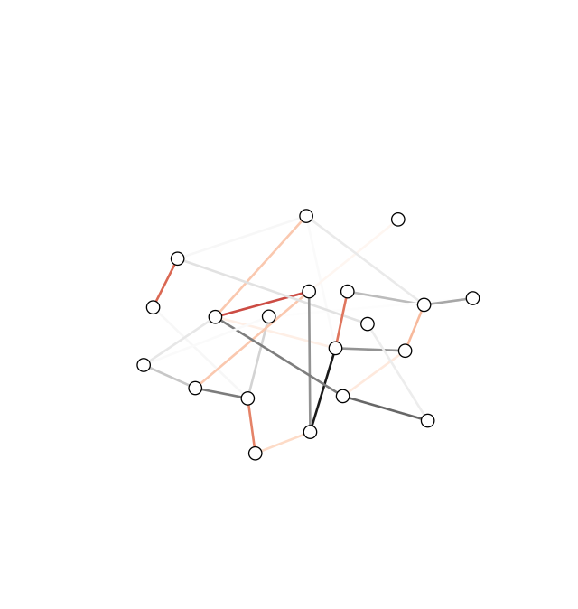
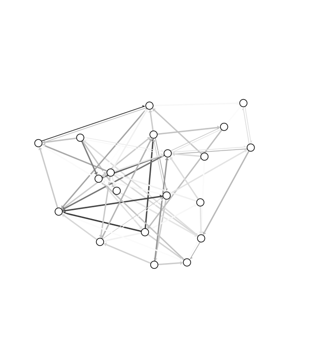
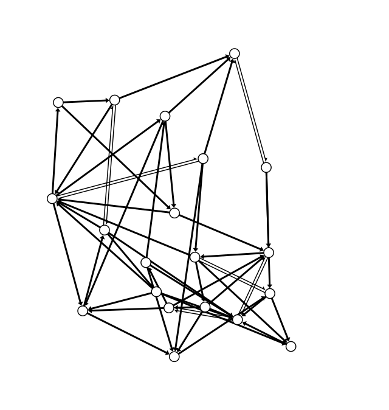
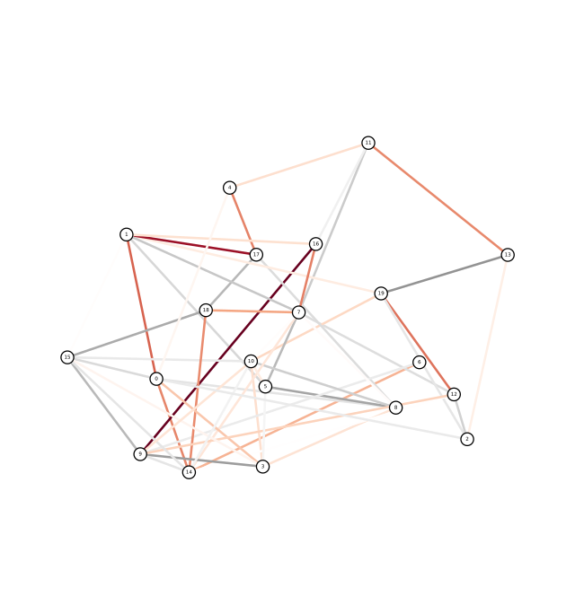
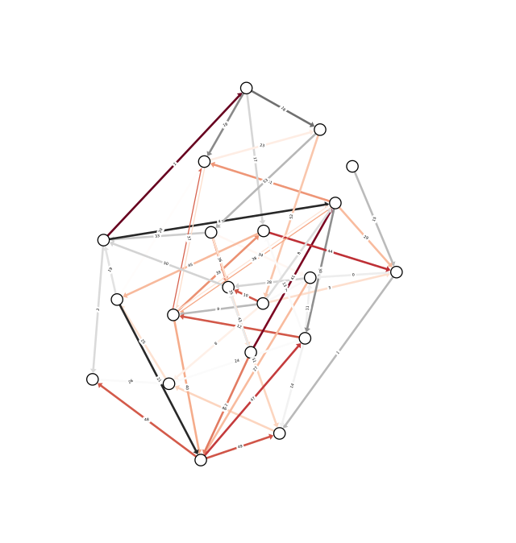

# netgraph

Python module to make publication quality plots of weighted, directed
graphs of medium size (10-100 nodes). Unweighted, undirected graphs
will look perfectly fine, too. The node positions can be tweaked using
the mouse (after an initial draw). It only depends on numpy and
matplotlib.



## Raison d'être:

Existing draw routines for networks/graphs in python (networkx, igraph) use
fundamentally different length units for different plot elements. This makes it hard to
- provide a consistent layout for different axis / figure dimensions, and
- judge the relative sizes of elements a priori.

This module amends these issues. 

Furthermore, algorithmically finding a visually pleasing layout of
node positions is, in general, difficult. This is demonstrated by the
plethora of different algorithms in use (if graph layout was a solved
problem, there would only be one algorithm). To ameliorate this
problem, this module contains an `InteractiveGraph` class, which allows
node positions to be tweaked with the mouse (after an initial draw).


## Code example

```python
import numpy as np
import matplotlib.pyplot as plt; plt.ion()
import netgraph

# Construct sparse, directed, weighted graph
# with positive and negative edges:
total_nodes = 20
weights = np.random.randn(total_nodes, total_nodes)
connection_probability = 0.2
is_connected = np.random.rand(total_nodes, total_nodes) <= connection_probability
graph = np.zeros((total_nodes, total_nodes))
graph[is_connected] = weights[is_connected]

# Make a standard plot:
netgraph.draw(graph)

# Create an interactive plot.
# NOTE: you must retain a reference to the object instance!
# Otherwise the whole thing will be garbage collected after the initial draw
# and you won't be able to move the plot elements around.
plot_instance = netgraph.InteractiveGraph(graph)

# Access new node positions: 
pos = plot_instance.node_positions
```

`netgraph.draw` supports various formats for the `graph` argument. 

In order of precedence:

1. Edge list:

   Iterable of (source, target) or (source, target, weight) tuples,
   or equivalent (m, 2) or (m, 3) ndarray.
   
2. Adjacency matrix:

   Full-rank (n,n) ndarray, where n corresponds to the number of nodes.
   The absence of a connection is indicated by a zero.
   
3. igraph.Graph or networkx.Graph object

```python
import networkx
g = networkx.from_numpy_array(graph, networkx.DiGraph)
netgraph.draw(g)
```

There are many ways to customize the layout of your graph. For a full
list of available arguments, please refer to the documentation of
- `draw` 
- `draw_nodes`
- `draw_edges`
- `draw_node_labels`
- `draw_edge_labels`

## Installation

Easiest via pip:

```
pip install netgraph
```

For the newest and brightest (and probably buggiest) version:

```
pip install git+https://github.com/paulbrodersen/netgraph.git
```

## Gallery

The following images show the netgraph output when using the default
settings, i.e. the output of `draw` in the absence of any arguments
other than `graph`.

Default plot for a directed, weighted network:


No arrows are drawn if the network appears undirected:


Edge weights are mapped to edge colors using a diverging colormap, by default 'RdGy'.
Negative weights are shown in red, positve weights are shown in gray.
A directed network with purely positive weights hence looks like this:


Unweighted networks are drawn with uniformly black edges:


Labels can be drawn on top of nodes.


Labels can be drawn on top of edges:



