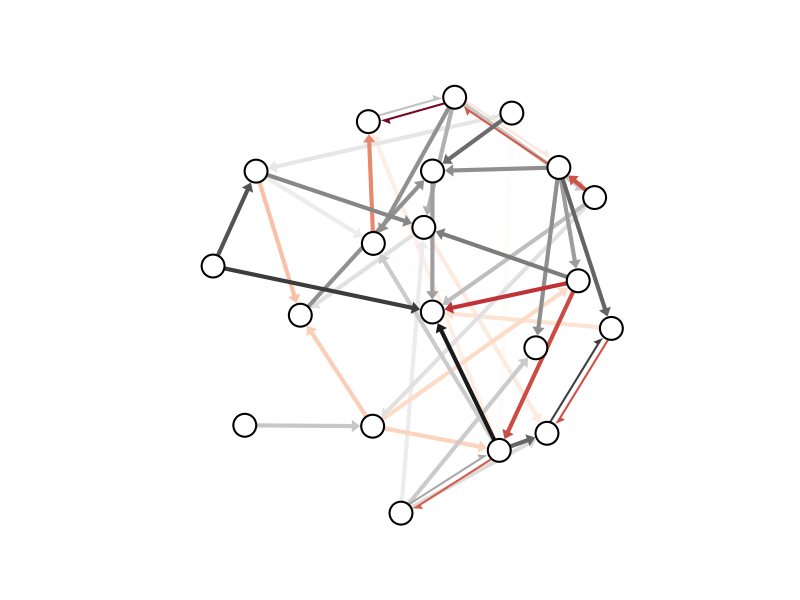

# netgraph
Fork of networkx drawing utilities for publication quality plots of networks

## Summary:

Module to plot weighted, directed graphs of medium size (10-100 nodes).
Unweighted, undirected graphs will look perfectly fine, too, but this module
might be overkill for such a use case.

## Raison d'etre:

Existing draw routines for networks/graphs in python use fundamentally different
length units for different plot elements. This makes it hard to
    - provide a consistent layout for different axis / figure dimensions, and
    - judge the relative sizes of elements a priori.
This module amends these issues. 

Furthermore, this module allows to tweak node positions using the
mouse after an initial draw.

## Example:

```python
import numpy as np
import matplotlib.pyplot as plt
import netgraph

# construct sparse, directed, weighted graph
# with positive and negative edges
n = 20
w = np.random.randn(n,n)
p = 0.2
c = np.random.rand(n,n) <= p
w[~c] = np.nan

# plot
netgraph.draw(w)
plt.show()
```



If no node positions are explicitly provided (via the `node_positions` argument to `draw`),
netgraph uses a spring layout to position nodes (Fruchtermann-Reingold algorithm).
If you would like to manually tweak the node positions using the mouse after the initial draw,
use the InteractiveGraph class:

```python
graph = netgraph.InteractiveGraph(w)
```

The new node positions can afterwards be retrieved via:

```python
pos = graph.node_positions
```

## IMPORTANT NOTE:

You must retain a reference to the InteractiveGraph
instance at all times (i.e. `graph` in the example above).  Otherwise,
the object will be garbage collected and you won't be able to alter
the node positions interactively.
